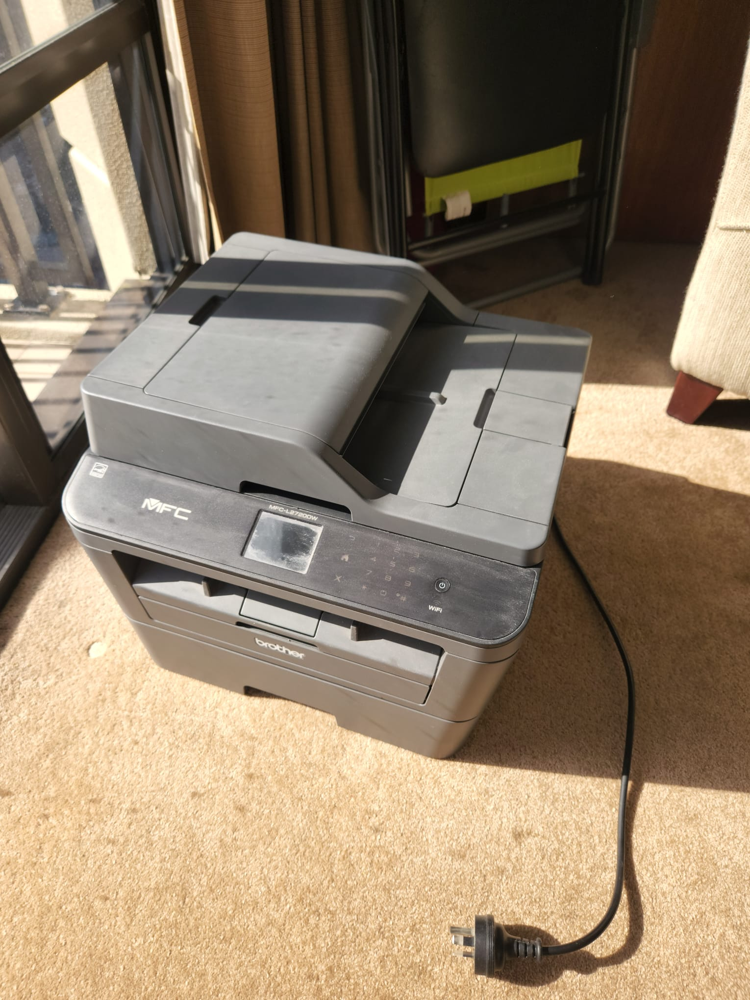
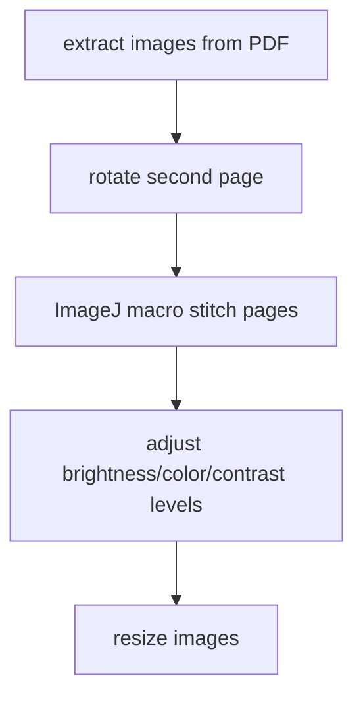
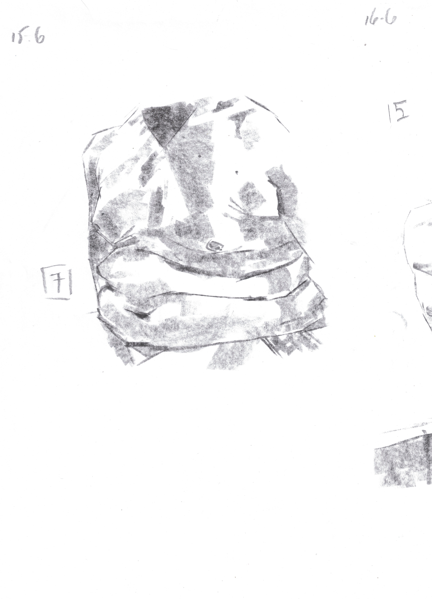
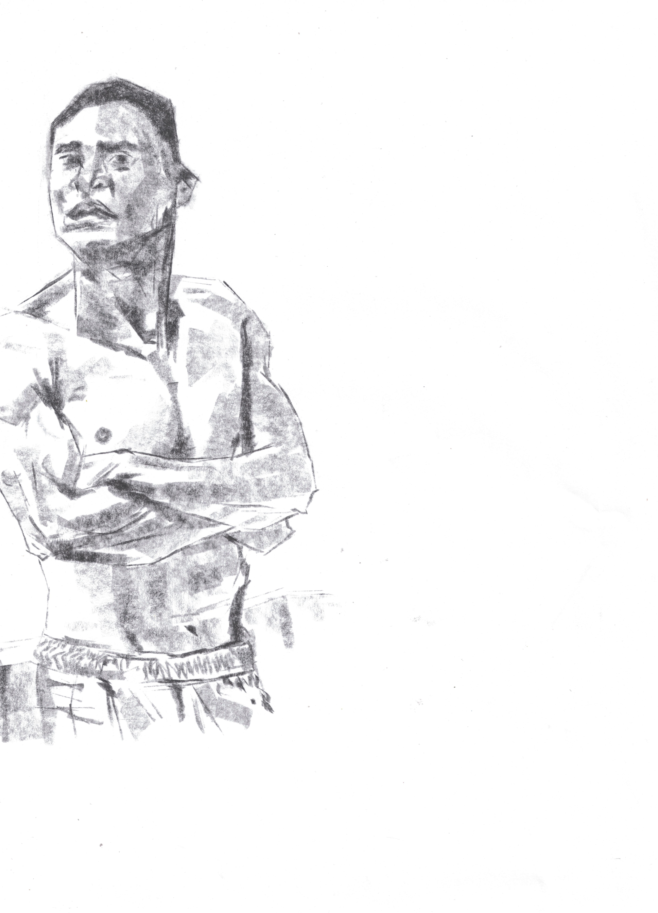
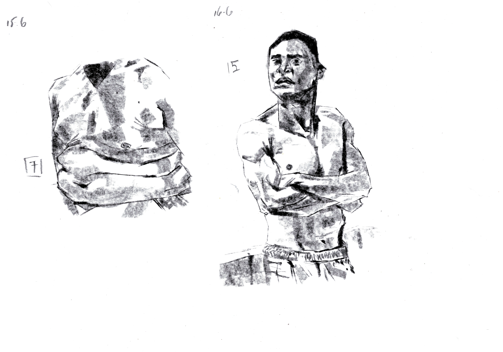
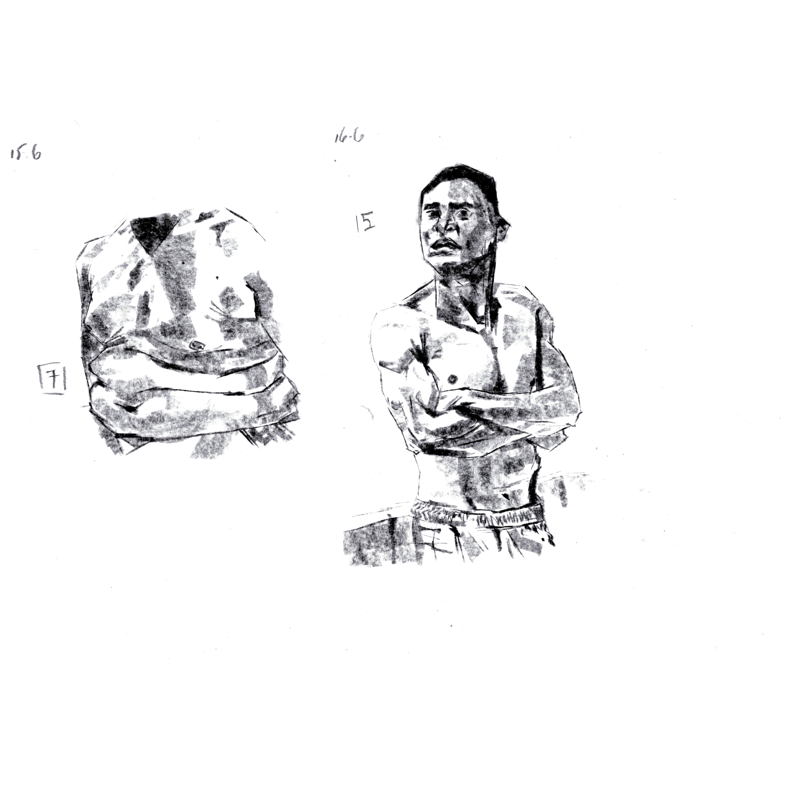

# A4-to-A3

A Python script that uses Python libraries, ImageJ, and ImageMagick to
automatically convert a scanned PDF with two A4 pages, into a single A3.

## Motivation

The use case is scanned A3 pages used for life-drawing sessions at the
[Auckland CBD Life Drawing](https://www.facebook.com/groups/aklcbdlifedrawing)
group.

These A3 pages are scanned in a Brother MFCL2720DW Monochrome wireless
laser all-in-one printer. Due to the scanner glass size, it is not possible
to scan the document in one go.



The A3 page is scanned twice. The first half is scanned facing up, and the
second half needs to be scanned rotated 180 degrees. Previously GIMP was
used to stitch the images, manually, changing opacity of layers.

OpenCV contains a stitching function, but it is not able to identify
enough key points between images, since normally there are two drawings
per page, with the mid-area of the drawing quasi-empty.

ImageJ comes with a plug-in for stitching that, when combined with a
selection to reduce the search-area, works as well as the manual
work flow with GIMP.

Instead of spending between 15 minutes, now the whole process takes
less than 10 seconds to copy the files and execute the command line.
The program takes between 1 and 2 minutes to process 6 files, creating
the final image with color, brightness, and contrast levels adjusted,
and an image with the canvas size with equal width and height (useful
for social medias like Instagram, for instance).

## Dependencies

The Python libraries used are:

- [pypdfium2](https://pypi.org/project/pypdfium2/)
- [Pillow](https://pypi.org/project/Pillow/)
- [joblib](https://pypi.org/project/joblib/)

The version of ImageJ used is ImageJ 1.53q, for Linux without a JRE.
Due to libraries from the Sun namespace, and how ImageJ tries to
load JVM libraries, it is necessary to use an Oracle JVM version 8:

```bash
kinow@ranma:~/Downloads/Fiji.app$ export PATH=/usr/lib/jvm/java-8-oracle/bin:$PATH
kinow@ranma:~/Downloads/Fiji.app$ ./ImageJ-linux64 
Java HotSpot(TM) 64-Bit Server VM warning: ignoring option PermSize=128m; support was removed in 8.0
Java HotSpot(TM) 64-Bit Server VM warning: Using incremental CMS is deprecated and will likely be removed in a future release
```

And the following version of ImageMagick was used, installed via `apt`
in Ubuntu 20.04.4 LTS:

```bash
kinow@ranma:~/Downloads/Fiji.app$ convert -version
Version: ImageMagick 6.9.10-23 Q16 x86_64 20190101 https://imagemagick.org
Copyright: © 1999-2019 ImageMagick Studio LLC
License: https://imagemagick.org/script/license.php
Features: Cipher DPC Modules OpenMP 
Delegates (built-in): bzlib djvu fftw fontconfig freetype jbig jng jpeg lcms lqr ltdl lzma openexr pangocairo png tiff webp wmf x xml zlib
```

## Installation

Verify that the JVM, ImageJ, and ImageMagick versions are installed first.
Clone this repository and install the Python dependencies with `pip`:

```bash
pip install -U pip
pip install -U -r requirements.txt
```

> A virtual environment is recommended.
 
## Usage

```bash
(venv) kinow@ranma:~/Development/python/workspace/a4-to-a3$ python main.py -h
usage: main.py [-h] [--keep-files] [--debug] IN [IN ...]

Converts a 2-page A4 document into a single page A3, stitching images that overlap.

positional arguments:
  IN            Input PDF

optional arguments:
  -h, --help    show this help message and exit
  --keep-files  Flag to keep intermediary files (left and right pages)
  --debug       Log debug information
```

You can pass a single or multiple PDF's. The process flow of the script is
the following:



## Example

This repository contains an example from a figure drawing session.

The original input is the file [`example.pdf`](./example.pdf). 
The first page extracted from the PDF.



The second page extracted from the PDF, rotated 180 degrees.



The images have been inverted, stitched, inverted again, and saved as a single page.



And another version with same width and height sizes.


